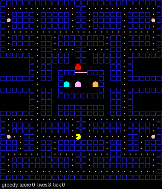
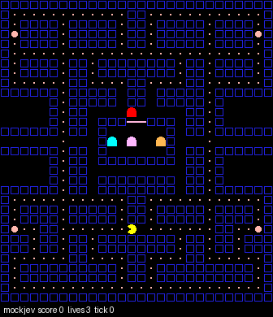
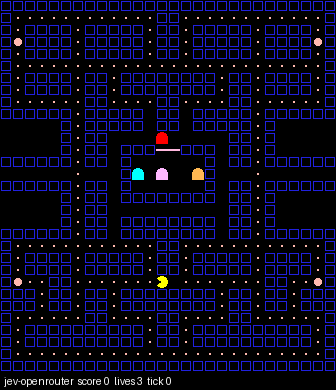

# Jev 吃豆人环境

一个自带经典吃豆人规则的决策环境，专门为 TypeSafe 的 **Jev**（System One 极速决策模型）设计，同时也可以当普通强化学习环境用。

Jev 不生成文字，只回答结构化问题（Choice / Score / Noul），延迟 70～500ms。所以这个环境每一步都会：

1. 把局面整理成结构化 `state`：分数、命数、幽灵位置和状态、ASCII 地图，以及**每个可走方向的预计算特征**（离豆子几步、离危险幽灵几步、离受惊幽灵几步等）；
2. 把“往哪走”包装成一道 `Choice` 题，选项就是当前能走的方向；
3. 把 Jev 的选择作为动作执行。

| 规则基线（回合制，通关） | 模拟 Jev（实时模式，约 300ms 延迟） | 真 Jev（实时 200ms 节拍，跟不上） |
|---|---|---|
|  |  |  |

## 安装

```bash
pip install -r requirements.txt           # numpy, pillow
pip install typesafe-sdk                   # 走 TypeSafe 官方 SDK 时才需要
```

API key 放进项目根目录的 `.env`（已被 `.gitignore` 忽略），`run.py` 启动时自动加载：

```bash
cp .env.example .env     # 然后填 OPENROUTER_API_KEY
```

也可以照旧用环境变量，环境变量优先于 `.env`。

## 快速开始

```bash
# 规则基线（回合制）
python run.py --agent greedy --episodes 10

# 在终端里实时观看对局
python run.py --agent greedy --watch

# 离线模拟 Jev（模拟 70~500ms 延迟），实时模式，边看边录 GIF
python run.py --agent mockjev --mode realtime --tick-ms 150 --watch --gif demo.gif --gif-every 2

# 真 Jev（方式一：OpenRouter，不用排队，充值即用，只依赖标准库）
python run.py --agent jev-openrouter --mode realtime --tick-ms 600 --watch

# 真 Jev（方式二：TypeSafe 官方，需要排队拿资格）
python run.py --agent jev --mode turn --episodes 3
```

OpenRouter 方式调用 `POST https://openrouter.ai/api/alpha/decisions`，模型为 `~typesafe/jev-latest`，
会自动使用系统代理并复用长连接。

常用参数：`--ghosts 0~4` 调幽灵数量、`--lives`、`--max-ticks`、`--no-map`（不发 ASCII 地图，减少输入）、
`--watch` / `--watch-ms`（终端可视化及其最小刷新间隔）、`--gif` / `--gif-every`、`--json result.json` 保存结果。

## 可视化

两种看法，可以同时开：

- `--watch`：ANSI 真彩色在终端里逐帧重绘，不依赖第三方库。墙是蓝色实心块，幽灵是彩色方块（受惊时变蓝并在结束前闪白，被吃后变成一对眼睛），吃豆人是朝向箭头，底部一行显示分数 / 命数 / tick / 吃豆进度 / 受惊倒计时。
- `--gif out.gif`：把第一局用 Pillow 画成 GIF。

在自己的脚本里用：

```python
from jev_pacman.viewer import TerminalViewer, render
run_realtime(env, agent, recorder=TerminalViewer(min_frame_ms=60))
print(render(env))      # 只要一帧字符串
```

`Tee(viewer, gif)` 可以把同一帧同时喂给多个观察者。

## 两种模式

| 模式 | 规则 | 考察什么 |
|---|---|---|
| `turn` 回合制 | 环境等模型想好再走一步 | 决策质量 |
| `realtime` 实时 | 环境按 `--tick-ms` 固定节拍前进，模型在后台不停决策；想慢了就错过若干 tick，吃豆人沿用上一个指令 | 又快又准 |

实时模式的结果会多出 `stale_ticks_mean`：决策生效时局面已经过去了多少个 tick。

## 实测（Jev via OpenRouter）

模型 `typesafe/jev-1.13-20260917`，中国大陆家宽经本地代理，4 只幽灵、3 条命：

| 模式 | tick | 结果 | 决策延迟 p50 / p95 | 平均落后 |
|---|---|---|---|---|
| 回合制 | — | 2260 分，194/244 豆，剩 2 命（300 tick 上限） | 705 / 1220 ms | — |
| 实时 | 600ms | 920 分，92/244 豆，剩 1 命（300 tick 上限） | 860 / 1332 ms | 1.54 tick |
| 实时 | 200ms | 530 分，146 tick 丢光 3 条命 | 855 / 4747 ms | 6.64 tick |

决策质量是够的（回合制能吃到八成豆子），瓶颈在端到端延迟：**一次决策约 800ms**，
其中模型本身按 Jev 的规格只占 70～500ms，剩下是跨境网络往返。
所以 tick 低于 ~500ms 时吃豆人基本在用过期指令走路，一撞幽灵就连掉命。
想压低延迟就得离服务端更近，或者改用本地部署。

网络这一段实测：

| 走法 | 建连（含 TLS 握手） | 复用长连接后的单次决策 |
|---|---|---|
| 经代理 | ~1190ms | 中位 766ms，最小 566ms |
| 直连 | 中位 ~483ms，但 8 次里有 2 次握手超时 | 中位 797ms，最小 731ms |

直连**能通**，稳态延迟和走代理没有区别（差异在噪声范围内），但 TLS 握手会间歇性超时
（DNS 解析到 Cloudflare 104.18.2.115 / 104.18.3.115）。实时模式下一次超时就够丢一条命，
所以默认仍然沿用系统代理；离线跑回合制可以直接直连。

## 接入 Jev 的代码位置

`jev_pacman/agents/jev.py`

- `JevAgent.from_typesafe()`：用 `typesafe_sdk.TypeSafeClient` 和 `Choice`
- `JevAgent._ask()`：唯一直接调用 SDK 的地方，调用方式是
  `client.system_one(state=..., questions={"move": Choice(instructions=..., criteria={...})})`，
  读取 `response.answers["move"].choice / .probabilities / .confidence`
- 提示语在 `INSTRUCTIONS`，每个选项的描述由 `describe_move()` 生成

以上调用方式来自 Jev 的公开示例。如果正式版 SDK 的字段名不同，只需要改 `_ask()`。
API 报错时不会中断游戏，会沿当前方向继续走，并在结果里记录 `api_errors` / `last_error`。

## 作为强化学习环境使用

```python
from jev_pacman import PacmanEnv, PacmanConfig

env = PacmanEnv(PacmanConfig(obs_type="planes"))   # state | grid | planes | text
obs, info = env.reset(seed=0)
obs, reward, terminated, truncated, info = env.step("LEFT")   # 或下标 0~4: NOOP UP DOWN LEFT RIGHT
```

- `planes`：`(7, 31, 28)` 的 float32，通道为墙 / 豆子 / 能量豆 / 吃豆人 / 危险幽灵 / 受惊幽灵 / 眼睛
- 奖励：得分增量；死亡 -200，通关 +500（可在 `PacmanConfig` 中调整）
- 难度：`ghost_speed`（默认 0.9，调到 1.0 更难）、`frightened_ticks`、`schedule`

## 自定义智能体

任何实现了 `act(state) -> "UP"|"DOWN"|"LEFT"|"RIGHT"` 的对象都能直接用 `run_turn_based` / `run_realtime` 跑。

## 规则说明

标准 28×31 迷宫，244 颗豆子（含 4 颗能量豆），左右隧道互通。四只幽灵沿用原版的追踪逻辑（Blinky 直追、Pinky 堵前方、Inky 夹击、Clyde 近了就跑），有分散/追击交替和受惊模式。连吃幽灵依次得 200 / 400 / 800 / 1600 分。为了简化，只有一关，没有水果。
